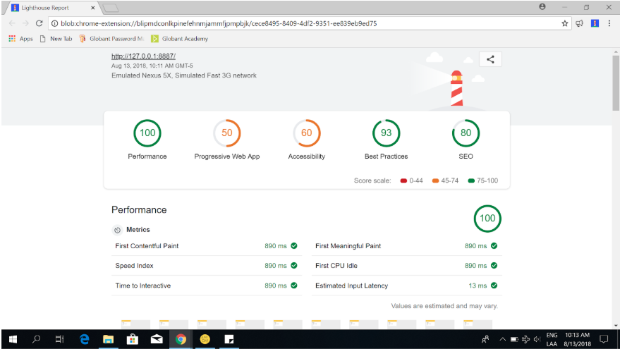
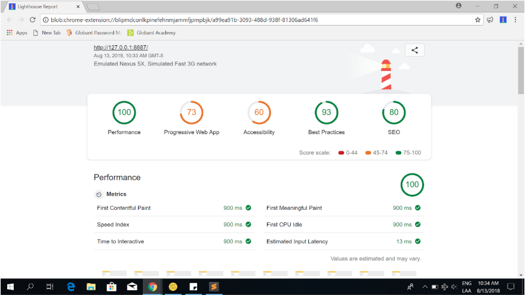
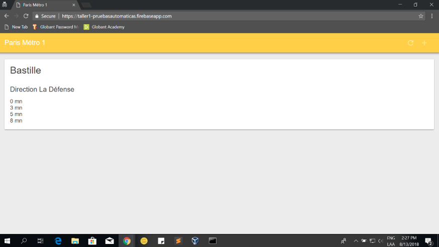
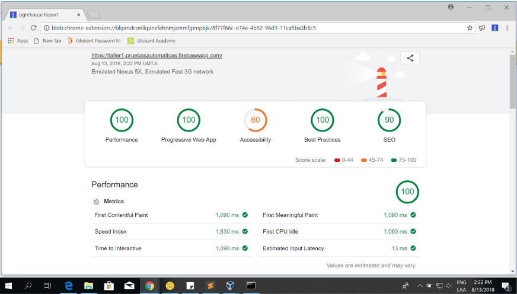
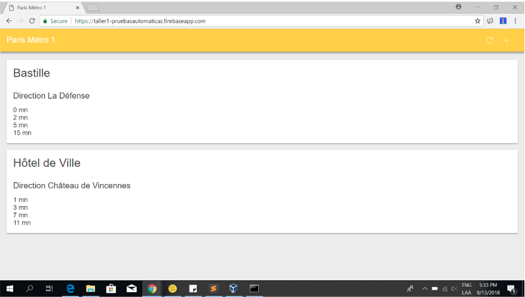
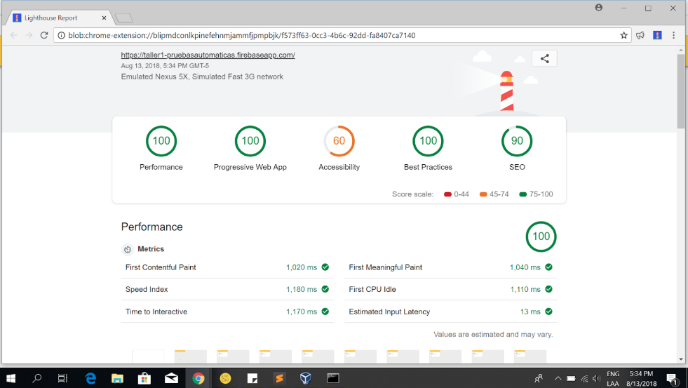
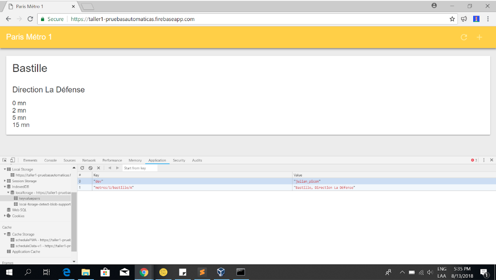
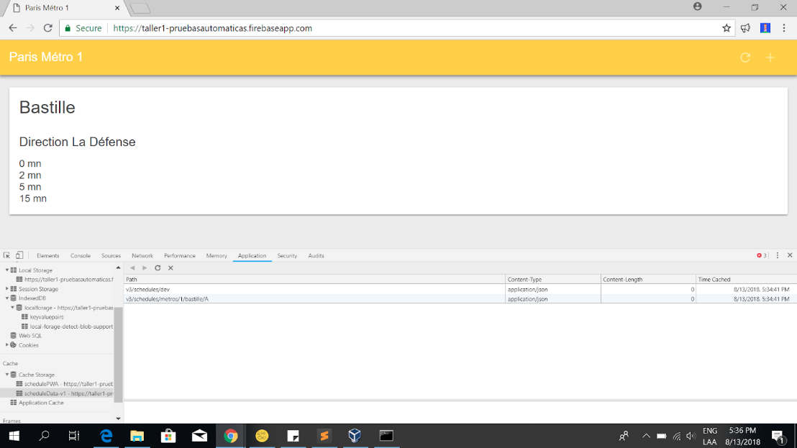
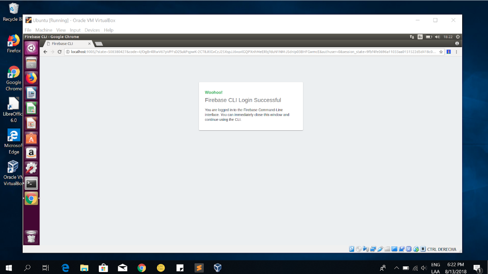

# MISO-AT-Workshop 1

Your First Progressive Web App
 
https://miso-4208-labs.gitlab.io/talleres/taller1.html

Captura realizada con el código original proporcionado:

Creando service worker y almacenando en cache elementos básicos (html, css, imagenes y js):

https://taller1-pruebasautomaticas.firebaseapp.com/

Integrando IndexDB - LocalForage

https://programacion.net/articulo/como_mejorar_indexeddb_con_localforage_1830

Despliegue firebase:

